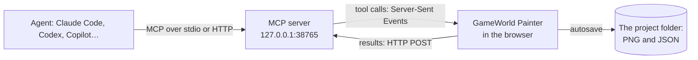

# GameWorld Painter MCP server

Lets AI agents — Claude Code, Codex, GitHub Copilot (CLI and VS Code), Cursor, Claude Desktop, Gemini CLI and any other
[Model Context Protocol](https://modelcontextprotocol.io) client — read and edit the map open in
[GameWorld Painter](https://aleserb.github.io/game-world-painter/). Node.js 18 or newer, no dependencies.



The agent starts the server; the app (with **AI Agent** turned on in its header) connects to it. The tools run in the
page, on the open map: what the agent changes appears at once and is one step of the app's undo.

## Set up

1. Get the server: `git clone https://github.com/aleserb/game-world-painter` (it is `mcp/server.mjs`).
2. Add it to your agent once. `node mcp/server.mjs setup` prints these lines with the right path:

   | Agent | |
   |-------|-|
   | Claude Code | `claude mcp add --scope user game-world-painter -- node /path/to/game-world-painter/mcp/server.mjs` |
   | Codex | `codex mcp add game-world-painter -- node /path/to/game-world-painter/mcp/server.mjs` |
   | GitHub Copilot CLI | `copilot mcp add game-world-painter -- node /path/to/game-world-painter/mcp/server.mjs` |
   | Gemini CLI | `gemini mcp add --scope user game-world-painter node /path/to/game-world-painter/mcp/server.mjs` |
   | VS Code | `.vscode/mcp.json`: `{"servers": {"game-world-painter": {"type": "stdio", "command": "node", "args": ["/path/to/game-world-painter/mcp/server.mjs"]}}}` |
   | Cursor, Claude Desktop, Windsurf… | `{"mcpServers": {"game-world-painter": {"command": "node", "args": ["/path/to/game-world-painter/mcp/server.mjs"]}}}` |
   | Clients configured by URL | run `node mcp/server.mjs --http` and use `http://127.0.0.1:38765/mcp` |

3. Open the app, open your map and turn on **AI Agent** in the header. The LED is amber while the app waits for the
   server, green when an agent is connected, and pulses while the agent works. Click it for the same setup per agent,
   the skill, the activity log and the settings.
4. Optional, recommended: the skill, which teaches agents the workflow —
   `gh skill install aleserb/game-world-painter game-world-painter`, or copy
   [`skills/game-world-painter`](../skills/game-world-painter) into `~/.claude/skills/`, `~/.copilot/skills/`,
   `~/.codex/skills/` or a repository's `.github/skills/`.

Later the server will be on npm: `npx -y game-world-painter-mcp` instead of `node /path/to/…/server.mjs`.

## What the agent can do

| Tool | |
|------|-|
| `get_map_info` | Start here: unit, bounds, every layer with what it holds, zones, what the user looks at |
| `get_user_context` | The selected area and items, the active layer, the view, the cursor |
| `get_project_path` | The full path of the map's folder on this computer and of every layer file, what the app has not saved |
| `open_map`, `create_map` | Open a map by its folder path, or make a new one there (bounds, unit, cell size, a set of layers); opens the app in the browser when none is connected |
| `render_map` | An image of the map (north up) with a coordinate grid; a highlight |
| `describe_region` | Everything in a region: size, mask coverage, class shares, heights and slopes, items by kind |
| `read_layer` | A coarse grid of a mask, categories or height layer |
| `find_items` | Objects, notes, paths with filters; distances to other layers, height, slope, zone |
| `analyze_items` | Spacing, too-close pairs, groups, the largest gaps |
| `find_spots` | Open (exposed), enclosed (hidden), high (viewpoints), low, flat, steep, empty, far from / near to layers |
| `analyze_walkability` | Walkable ground, isolated pockets, narrow passages, unreachable items |
| `find_route` | A walking route around obstacles, preferring roads, away from danger; can add it as a path |
| `scatter_items` | Many objects placed naturally: spacing, count, density from a mask, distances to keep, groups, random props |
| `add_items`, `update_items`, `delete_items` | Exact edits of objects, notes and paths (deletion can ask the user); objects by their center and yaw, by their two ends `a`, `b`, or `towards` a point |
| `find_crossing` | Where to cross water: the narrowest places, with the bank points `a`, `b` for a bridge straight across the flow |
| `check_change` | The agent sees its change before the user does: BEFORE / AFTER images, what changed, checks of every placed object |
| `paint_layer` | Masks (percent) and categories (classes) over a region, with a soft edge and noise |
| `edit_terrain` | Raise, lower, flatten, smooth, slope (from a place to another), noise |
| `create_layer`, `update_layer` | New layers; names, groups, colors, visibility, classes |
| `show_on_map` | Moves the user's view to something and outlines it, with a message; can select it |
| `undo` | Undoes the agent's latest changes (in review mode: withdraws its proposal) |
| `begin_change`, `end_change` | Group several calls into one change with a title and a summary: one undo step, or one proposal in review mode |
| `wait_for_review` | Review mode: wait for the user's decision on a proposal |

The changing tools take a `comment`: the agent's words on the change (what and why), shown to the user with it.
`get_user_context` tells what the user selected — objects (with Select or the Select area tools: rectangle, ellipse,
lasso, polygon, same kind) and areas — so "these" and "here" mean something.

Most tools take a **region**: `{"area":"selection"}`, `{"items":"selection"}`, `{"zone":"village"}`, `{"layer":"trees","min":50}`,
`{"near":"roads","distance":8}`, `{"rect":[x0,z0,x1,z1]}`, `{"slope":{"max":25}}`, … combined with
`{"all":[…]}`, `{"any":[…]}`, `{"not":…}` — see [the skill's reference](../skills/game-world-painter/references/regions.md).

The server also offers the skill and the [project format](../docs/project-format.md) as MCP resources
(`gwp://skill`, `gwp://project-format`).

## How it works

- **Agents** start `server.mjs` and speak MCP over stdio. One process owns the port (`38765`): the app connects
  there. When a second agent starts another process, it finds the port taken by a GameWorld Painter server and
  relays its calls through it; when the first one exits, the next takes the port over and the app reconnects.
- **The app** holds a Server-Sent Events stream (`/app/events`) and posts results (`/app/result`). One tab at a time
  (the latest).
- **Protocol**: dual-era MCP. Legacy clients get the `initialize` handshake (2024-11-05 to 2025-11-25). Modern requests
  carry `_meta` per request (2026-07-28, with `server/discover`). Streamable HTTP at `/mcp` serves both: sessions for
  legacy clients, stateless with header checks for modern ones. JSON-RPC batches are accepted.
- **Maps by path** (`open_map`, `create_map`): browsers cannot open a folder from a path, so the app reads and
  writes such a map **through this server** (`/fs/stat`, `/fs/read`, `/fs/write` — atomic, `/fs/remove`). The server
  serves only folders the agent opened or created, only to the connected app tab (its session), never outside the
  folder (no `..`, no links out). When no app is connected it opens the default browser at
  `https://aleserb.github.io/game-world-painter/?mcp=<port>&map=<path>` (the app on that link turns AI Agent on with
  this local server and waits for the map). After a reload the app opens the map again once the server is connected.
- **Self-check**: the changing calls return `checks` for the objects they placed — overlaps, objects in water or on
  roads, uneven ground, bridges (both ends on dry land, over the water, about 90° to the flow) — and `check_change`
  adds two images of the place (BEFORE and AFTER, the agent's objects outlined and labeled, problems in red).
  `end_change` runs the checks and keeps the change open while problems are left (unless the agent gives
  `ignore_problems` with a reason); in review mode a single call with problems is not shown for review. The card shows
  the result of the self-check. Bridges and other crossings are walkable for `find_route` and `analyze_walkability`.
- **Changes on a card**: `begin_change` … `end_change` groups calls; a call alone is a change too. The card at the top
  right of the map (the user can drag it elsewhere) shows the agent's title, description or summary, and each step with its `comment` (lines,
  `- ` lists, `**bold**`, `` `code` ``).
- **Review mode** (AI Agent → Settings → *Review the agent's changes*, on by default): a change is applied but held — shown on the map
  with the card (title, what changed, Before / After), not saved, its layers locked for the user — until the user
  clicks **Accept** (kept and saved), **Change…** (undone; their comment goes to the agent as `feedback`) or
  **Reject** (undone). The changing call waits for the decision up to 45 s (agents such as Codex give up on a call
  after 60 s); after that it returns `pending` and the agent calls `wait_for_review`. An accepted proposal is one
  undo step. With review mode off, changes apply at once; a group is one undo step, and the card shows it with
  **Undo** for a while.
- **Undo**: each tool call that changes the map is one step named “AI: …” in the app (a group: one step named after it). The agent's `undo` only undoes
  its own latest steps.
- **The folder on disk** (`get_project_path`): browsers do not reveal paths, so the app sends what identifies its folder
  (the name, a SHA-256 of `metadata.json`, the sizes and dates of the layer files) and the server finds it on disk. It
  looks in the path the app remembers, the agent's workspace roots (MCP `roots/list`), its working directory, the folders
  in `GWP_PROJECT_DIRS`, then the home folder (`GWP_SEARCH_HOME=0` turns that off; on macOS Desktop, Documents and
  Downloads come last, as macOS may ask before they are read). Tool and system folders (`node_modules`, `.git`,
  `Library`…) are skipped; the search stops after 8 s. The app remembers the path and shows it (the folder in the
  bottom bar, AI Agent → Settings, where the user can also type it).

## Security

- The server listens on **127.0.0.1** only, and refuses a `Host` that is not a loopback name (DNS rebinding).
- Browsers may connect only from **allowed origins**: the hosted app (`https://aleserb.github.io`) and pages on
  `localhost` / `127.0.0.1`. Add others with `--allow-origin <origin>` (`null` for a page opened from the disk). The
  relay endpoints refuse browsers entirely.
- In the app: **AI Agent** is off until the user turns it on. Settings let the agent only read, and ask the user before it deletes.
  Locked layers stay locked.

## Options

```
node server.mjs [--port 38765] [--http | --stdio] [--allow-origin <origin>]… [--timeout 120] [--quiet]
node server.mjs setup        print the setup for each agent
```

| Option | |
|--------|-|
| `--port` | The port the app and the agents meet at (env `GWP_MCP_PORT`). Change it in the app too (Settings). |
| `--http` | Run alone, with the Streamable HTTP endpoint `/mcp` (the default when started in a terminal) |
| `--stdio` | MCP over stdin / stdout (the default when an agent starts it) |
| `--allow-origin` | Another web origin allowed to connect as the app (repeat) |
| `--timeout` | Seconds a tool call may take in the app (deletions that wait for the user: 10×) |
| `--app-url` | The app opened for `open_map` / `create_map` when none is connected (default the hosted one, or the last one that connected; env `GWP_APP_URL`) |
| `--no-browser` | Never open a browser: the tool returns the link instead (env `GWP_OPEN_BROWSER=0`) |
| `--quiet` | No log on stderr (the log never goes to stdout) |

Environment: `GWP_MCP_PORT` (the port), `GWP_PROJECT_DIRS` (folders to search for the map's folder, separated by
`:` or `;` on Windows), `GWP_SEARCH_HOME=0` (do not search the home folder).

## Troubleshooting

- **The LED stays amber**: no server at the app's URL. Agents start it when they start; check that the agent lists
  the server (`/mcp` in Claude Code and Copilot CLI) or run `node mcp/server.mjs` in a terminal.
- **Chrome asks to “access other apps and services on this device”** (Local Network Access): allow it — the page
  talks to the server on this computer.
- **“GameWorld Painter is not connected”** in the agent: turn on AI Agent in the app and keep the tab open.
- **Port in use** by another program: `--port 38766` in the agent's command and the same port in the app.
- **A page opened from the disk** (`file://`): start the server with `--allow-origin null`, or serve the app over HTTP.

## Development

```
node --test mcp/test/*.test.mjs     the protocol, the bridge (with a fake app), origins, relays, HTTP, the folder search
node tests/agent.mjs                the app in headless Chrome + the server + every tool (Node 22+, Chrome)
```

The tools are declared in [`lib/tools.mjs`](lib/tools.mjs) and implemented in the app (`js/agent-*.js`).
